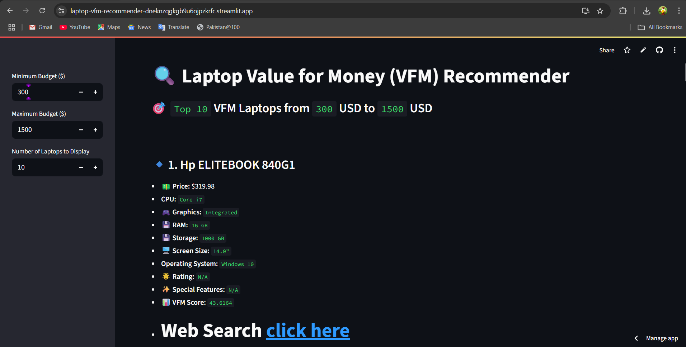
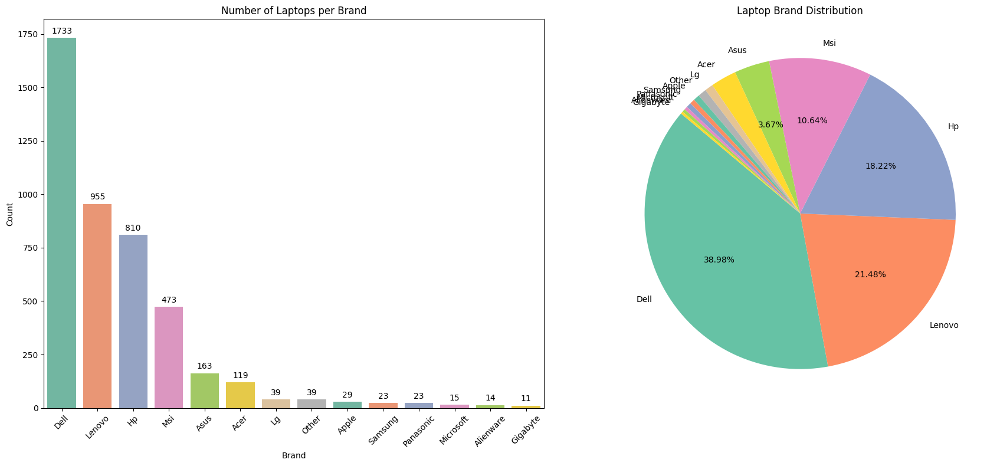
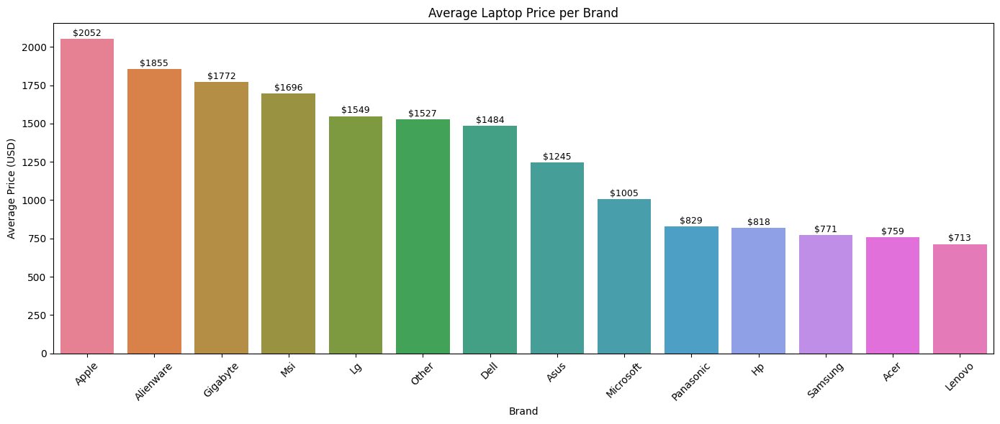
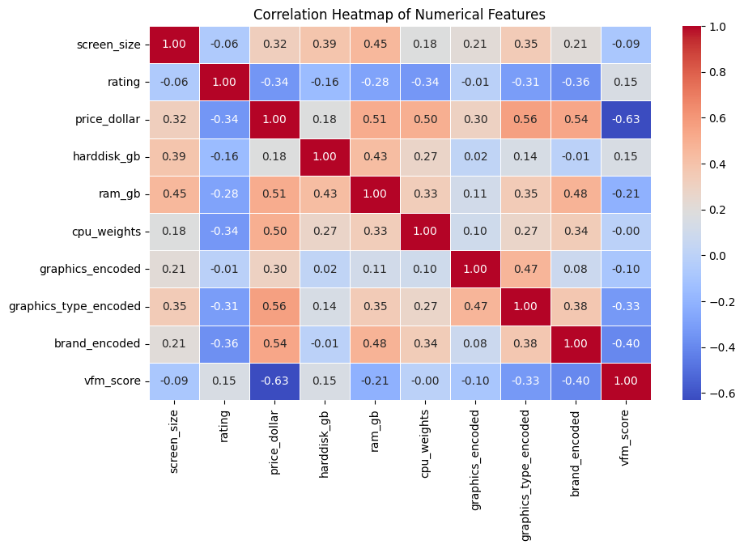

# 💻 Smart Laptop Buying Assistant – Value for Money Recommender 

Welcome to the **Smart Laptop Buying Assistant** – a machine learning-powered application designed to help users find the best **value-for-money laptops** within their budget. This tool intelligently analyzes a dataset of laptops to recommend options based on performance-weighted features, price, and user-defined criteria.

> link: `https://laptop-vfm-recommender-dneknzqgkgb9u6ojpzkrfc.streamlit.app/`
---

## 📌 Project Overview

Choosing a laptop can be overwhelming due to the variety of brands, specifications, and marketing noise. This project simplifies that process by:

- Extracting and cleaning real-world laptop listings
- Engineering features like CPU and GPU performance
- Calculating a **Value for Money (VFM) Score**
- VFM Score = (0.40 × normalized CPU performance) + (0.25 × normalized RAM) + (0.25 × normalized GPU) + (0.10 × normalized Storage)  − normalized Price
- Allowing users to search laptops by budget and specifications
- Providing instant Amazon search links for each recommendation

> ⚙️ Powered by Python, Pandas, Scikit-learn, Streamlit & Matplotlib.

---

## 🖼️ App Preview

=

*Main interface for User.*


*Brand Laptops Distribution.*


*Average Price By Brand.*


*Coerrelation Matrix.*

---

## 🔍 Features

- **Interactive Interface:** Enter your budget and get instant recommendations.
- **Value for Money Scoring:** Combines CPU, RAM, GPU, storage and price.
- **Real-Time Amazon Search Links:** Click to search the suggested laptop online.
- **Data Cleaning & Preprocessing:** Handles nulls, encodes features, imputes values.
- **Outlier Removal & EDA:** Visualizations and analysis of price, ratings, and specs.
- **Custom Encoding:** Brands, CPUs, and GPUs are weighted based on actual performance & price.

---

## 📊 Feature Engineering

| Feature              | Description |
|----------------------|-------------|
| `cpu_weights`        | Custom weights assigned based on CPU families (e.g. i9 > i7 > i5...) |
| `graphics_encoded`   | Encoded GPU types into performance tiers |
| `brand_encoded`      | Brands encoded by average laptop price |
| `vfm_score`          | Computed using normalized CPU, RAM, GPU, storage – minus normalized price |

---

## ⚒️ Tech Stack

- **Python 3.x**
- **Pandas & NumPy**
- **Scikit-learn**
- **Matplotlib & Seaborn**
- **Streamlit** – For interactive web deployment
- **Git & GitHub** – Version control and hosting

---

## 🧪 How It Works

1. Dataset of over 4,000+ laptops scraped from Amazon
2. Cleaned and imputed missing values
3. Feature engineered for CPU, RAM, GPU, Storage
4. Price outliers removed using IQR method
5. Scaled numerical values using MinMaxScaler
6. VFM score calculated for each laptop
7. Streamlit app allows users to:
   - Enter their budget range
   - Get top 10 recommendations
   - Click to search the model on Amazon

---

## 🛠️ Installation

```bash
git clone https://github.com/sdnr1418/laptop-vfm-recommender.git
cd laptop-vfm-recommender
streamlit run web_app.py
